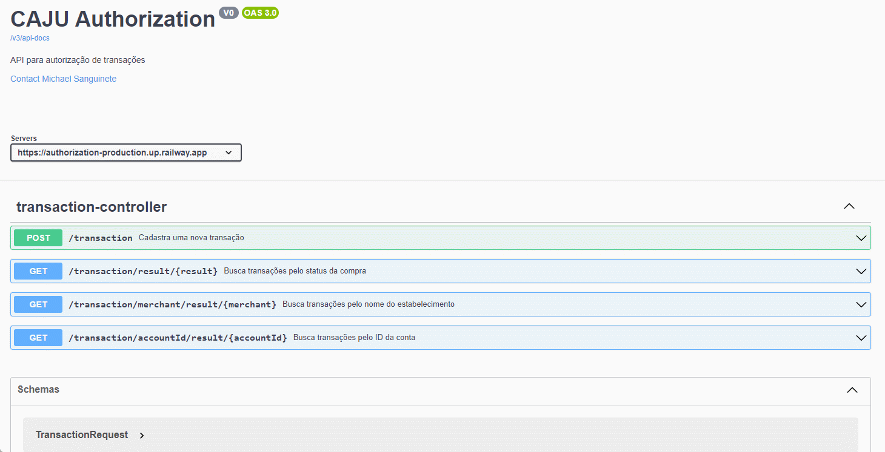
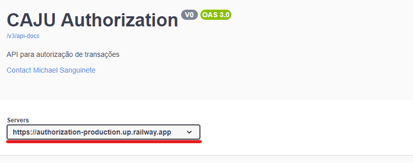

<h1 align="center">
    
    
Authorization🔒🔓

</h1>

## About
Projeto em **JAVA SpringBoot**, para simular autorizações de transações cartão Caju, baseado no tipo de estabelecimento.

## 🔨 Tools
- **[Java 17](https://www.oracle.com/java/technologies/javase/jdk17-archive-downloads.html)**
- **[SpringBoot 3.1.3](https://spring.io/projects/spring-boot)**
- **[Banco MySQL](https://www.mysql.com/)**
- **[OpenAPI/Swagger](https://springdoc.org/)**

<h2 align="center"> <a href="https://authorization-production.up.railway.app/swagger-ui/index.html" target="_blank">TESTAR API</a></h2>

Certifique-se de ter selecionado o server correto para a testatagem:

Este projeto já está pré-populado com dados de exemplo para facilitar a testagem. Você pode encontrar esses dados na tabela "account" e "transaction" no banco de dados MySQL.

#### Tabela `account`

| id | cash_balance | food_balance | meal_balance |
|----|--------------|--------------|--------------|
| 1  | 1000         | 1000         | 1000         |
| 2  | 1000         | 1000         | 1000         |
| 3  | 1000         | 1000         | 1000         |

#### Tabela `transaction`

| id | amount | mcc  | merchant    | rejection_cause        | result    | account_id | purchase_date       |
|----|--------|------|-------------|------------------------|-----------|------------|---------------------|
| 1  | 100    | 5411 | Padaria     | NULL                   | APROVADA  | 1          | 2023-09-03 21:57:14 |
| 2  | 100    | 5411 | Padaria     | Transação duplicada!   | REJEITADA | 1          | 2023-09-03 21:57:54 |
| 3  | 100    | 5412 | Mercado     | NULL                   | APROVADA  | 2          | 2023-09-04 10:57:00 |
| 4  | 1000   | 5812 | Restaurante | Saldo insuficiente!    | REJEITADA | 2          | 2023-09-05 14:26:14 |
| 5  | 100    | 1111 | Shopping    | NULL                   | APROVADA  | 3          | 2023-09-03 21:23:14 |
| 6  | 1000   | 5811 | Restaurante | Saldo insuficiente!    | REJEITADA | 3          | 2023-09-04 06:57:14 |

